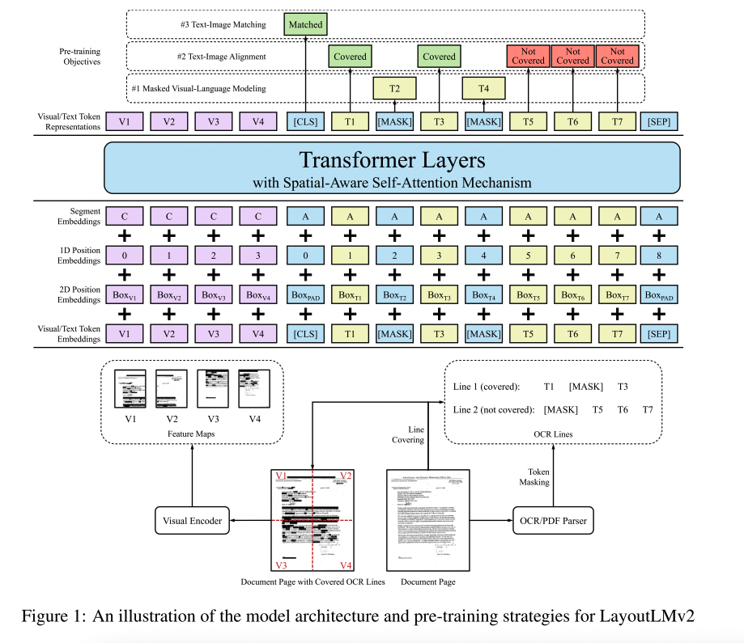

# [LayoutLMv2: Multi-modal Pre-training for Visually-Rich Document Understanding](https://arxiv.org/abs/2012.14740)

## TODO List

- [x] 论文主体结构疏离
- [x] 论文主要观点介绍
- [ ] 论文复现

## 1. 论文主题结构

### 1.1 摘要

由于其有效的模型体系结构和大规模未标记的扫描/数字出生文档的优势，文本和布局的预培训已被证明在各种视觉丰富的文档理解任务中是有效的。我们提出了具有新的预训练任务的LayoutLMv2体系结构，以在单个多模式框架中对文本，布局和图像之间的交互进行建模。具体来说，LayoutLMv2采用了双流多模态变换器编码器，不仅使用了现有的蒙面视觉语言建模任务，还使用了新的文本-图像对齐和文本-图像匹配任务，这使得它在预训练阶段更好地捕捉了跨模态交互。同时，它还将空间感知的自我注意机制集成到Transformer体系结构中，以便该模型可以充分理解不同文本块之间的相对位置关系。实验结果表明，LayoutLMv2在很大程度上优于LayoutLM，并在各种各样的下游视觉丰富的文档理解任务上获得了新的最新结果，包括FUNSD (0.7895 → 0.8420)，CORD (0.9493 → 0.9601)，SROIE (0.9524 → 0.9781)，克莱斯特-NDA (0.8340 → 0.8520) 、rvl-cdip (0.9443 → 0.9564) 和DocVQA (0.7295 → 0.8672)。

### 1.2 主要工作

#### 1.2.1 Text Embedding

文本embedding 主要采用WordPiece对每一个文本序列进行序列话标记 并为每一个序列进行标记， 另外对整个序列标记的起始位置添加[CLS]标记，每一个序列的结尾添加[SEP] 标记， 另外通过[PAD]进行padding填充，以此将每一个序列填充到最长序列长度L，则最终的文本Embedding为文本嵌入+1D position Embdding以及Seg Embedding之和表示， 如一下公式表示:

$$s_i=TokEmb(w_i)+PosEmb1D(i)+SegEmb(s_i)$$

#### 1.2.2 Visual Embedding

视觉信息主要采用了ResNeXt-FPN的结构，文档图像resize 至224X224 在模型最终输出后添加average_pool操作固定最终hotmap的大小，同时为了让视觉编码捕获位置信息，该视觉编码将添加1D的位置编码，从而视觉信息$v_i$由以下表示

$$v_i=Proj(VisTokEmb(I)_i)+PosEmb1D(i)+SegEmb([C])$$

#### 1.2.3 Layout Embedding

本文使用文本序列的坐标信息 ${x_{min},y_{min},x_{max},y_{max}, height, width}$六个embdding的concat作为其layout Embedding, $l_i$表示如下：

$$l_i = Concat(PosEmb2D_x(x_{min},x_{max},width),PosEmb2D_y(y_{min},y_{max},height))$$

另外针对文档Text Embedding中添加的[CLS],[SEP],[PAD]字段，均使用一个空的(0,0,0,0,0,0)坐标信息来填充其对应的LayoutEmbedding

 

#### 1.2.4 Layoutlmv2 Encoder

编码过程的输入为文本信息与视觉信息的concat，则第一层的输入表示为

$$x_{i}^{(0)}=X_i+l_i\\X=\{v_0,v_1...v_{WH-1},t_o,t_1,...t_{L-1}\}$$

 

遵循Transformer的体系结构，我们使用一堆多头自注意层，然后是前馈网络来构建多模态编码器。但是，原始的自我注意机制只能隐含地捕获具有绝对位置提示的输入令牌之间的关系。为了有效地对文档布局中的局部不变性进行建模，有必要显式插入相对位置信息。因此，我们将空间感知自我注意机制引入自我注意层。为简单起见，以下描述是针对单个自我注意层中的单个头部，其隐藏大小为dhead和投影矩阵WQ，WK，WV。原始的自我注意机制通过投影两个向量并计算注意得分来捕获查询xi和键xj之间的相关性.

$$a_{ij}=\frac{1}{\sqrt{d_{head}}}(x_iW^Q)(x_jW^K)^T$$

考虑到位置范围大，我们将语义相对位置和空间相对位置建模为偏差项，以防止添加太多参数。类似的做法已被证明在纯文本 Transformer 架构上是有效的（Raffel 等人，2020；Bao 等人，2020）。让 b(1D)、b(2Dx) 和 b(2Dy) 分别表示可学习的 1D 和 2D 相对位置偏差。注意头之间的偏差不同，但在所有编码器层中共享。假设 (xi, yi) 锚定第 i 个边界框的左上角坐标，我们得到空间感知注意力分数

$$a_{ij}=a_{ij}+b_{j-i}^{(1D)}+b_{x_j-x_i}^{(2D_x)}+b_{y_j-y_i}^{(2D_y)}$$

最后，输出向量表示为所有投影值向量相对于归一化空间感知注意力分数的加权平均值

$$h_i=\sum_{j}{}\frac{exp(\alpha_{ij})}{\sum_{k}{}exp(\alpha_{jk})}x_jW^V$$

### 1.3 预训练任务

#### 1.3.1 MVLM

与 vanilla LayoutLM 类似，我们使用 Masked VisualLanguage Modeling (MVLM) 使模型在语言方面通过交叉模态线索更好地学习。我们随机屏蔽一些文本标记，并要求模型恢复被屏蔽的标记。同时，布局信息保持不变，这意味着模型知道每个掩码标记在页面上的位置。来自编码器的掩码标记的输出表示被输入到整个词汇表上的分类器，由交叉熵损失驱动。为了避免视觉线索泄漏，我们在将原始页面图像输入上的掩码标记对应的图像区域输入到视觉编码器之前对其进行掩码。

#### 1.3.2 TIA

为了帮助模型学习图像与边界框坐标之间的空间位置对应关系，我们提出了文本图像对齐 (TIA) 作为细粒度的交叉模态对齐任务。在TIA任务中，随机选择了一些令牌行，并且它们的图像区域覆盖在文档图像上。我们将此操作称为覆盖，以避免与MVLM中的掩蔽操作混淆。在预训练期间，在编码器输出上方构建分类层。该层根据是否覆盖 (即 [覆盖] 或 [未覆盖]) 来预测每个文本令牌的标签，并计算二进制交叉熵损失。考虑到输入图像的分辨率是有限的，并且某些文档元素 (例如图形中的符号和条形图) 可能看起来像被遮盖的文本区域，因此查找单词大小的被遮盖的图像区域的任务可能是嘈杂的。因此，在行级执行覆盖操作。当同时执行MVLM和TIA时，不考虑MVLM中屏蔽的令牌的TIA损失。这样可以防止模型学习从 [MASK] 到 [覆盖] 的无用但直接的对应关系。

#### 1.3.3 TIM

此外，使用粗粒度的跨模态对齐任务文本图像匹配 (TIM) 来帮助模型学习文档图像和文本内容之间的对应关系。我们将 [CLS] 的输出表示馈送到分类器中，以预测图像和文本是否来自同一文档页面。常规输入是正样本。为了构建负样本，图像要么被另一个文档中的页面图像替换，要么被丢弃。为了防止模型通过查找任务特征来作弊，我们对负样本中的图像执行相同的掩码和覆盖操作。 TIA 目标标签在负样本中都设置为 [Covered]。我们在优化过程中应用二元交叉熵损失。

 

 

## 模型结构

 

 

## 作者

- [@watcher](https://github.com/mlshenkai)
